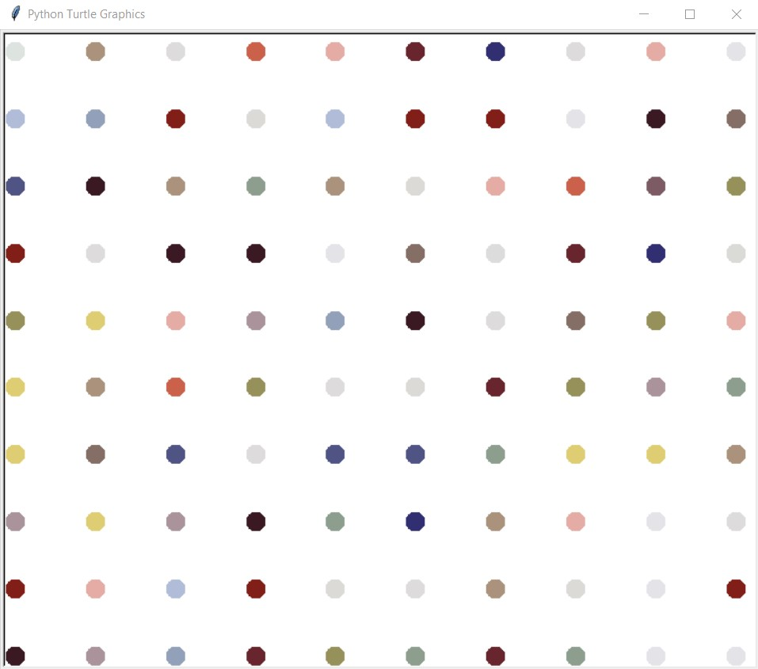

# Turtle Graphics

This set of python project are built using Python [turtle module](https://docs.python.org/3/library/turtle.html#module-turtle).

## Dot Art

Here is a sample dot art produced through running the `dot_painting.py`.

### Warning for Ubuntu or LINUX Users

When I tried running Turtle Module on my local machine through Ubuntu, I had some trouble with the tkinter module and $DISPLAY variable.
Hence, I made my Tutle graphics project via my PowerShell CLI (as I do not want to waste time setting up for Ubuntu or LINUX).